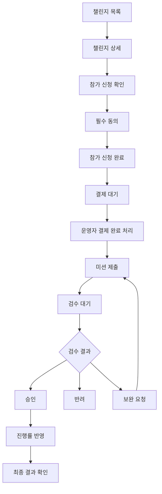
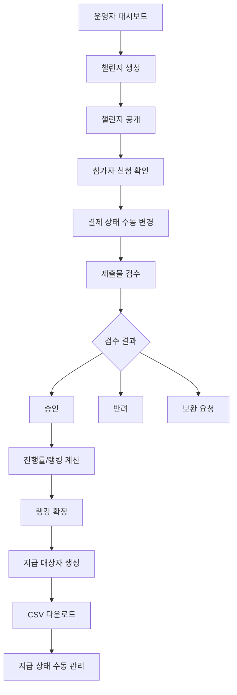

# 챌린지 매니저 플랫폼 프론트엔드 디자인 기획서

작성일: 2026-06-11  
참고 문서: `challenge-manager-platform-plan.md`, `challenge-manager-platform-prd-v2.md`  
문서 목적: 챌린지 매니저 플랫폼의 MVP 화면 구조, UX 흐름, 디자인 시스템, 컴포넌트, 반응형 기준을 정의한다.  
적용 범위: 웹 기반 MVP. 모바일 앱은 제외한다.

## 1. 디자인 방향

## 1.1 제품 포지셔닝

이 플랫폼은 일반 참가자용 리워드 앱이 아니라 브랜드, 쇼핑몰, 마케팅 대행사, 교육 사업자가 챌린지를 운영하기 위한 B2B 운영 도구다.

따라서 프론트엔드 디자인은 다음 방향을 따른다.

- 운영자가 반복 업무를 빠르게 처리할 수 있는 실무형 UI
- 참가자가 미션 제출과 상태 확인을 쉽게 할 수 있는 간결한 UI
- 상금, 결제, 지급 같은 민감한 정보는 과장하지 않고 투명하게 표시
- 광고 표시, 환불 정책, 검수 상태, 지급 상태를 명확하게 노출
- 카드형 마케팅 페이지보다 데이터 테이블, 필터, 상태 배지, 액션 버튼 중심
- 데스크톱 운영자 사용성을 우선하고, 참가자 화면은 모바일 반응형을 중요하게 설계

## 1.2 디자인 키워드

- 신뢰감
- 명확함
- 빠른 검수
- 상태 중심
- 증빙 가능성
- 운영 효율
- B2B SaaS

## 1.3 피해야 할 방향

- 게임처럼 보이는 과도한 보상 UI
- 참가비와 상금을 과하게 강조하는 도박성 인상
- 챌린지 커뮤니티 앱처럼 보이는 피드 중심 UI
- 화려한 랜딩 페이지 중심 구성
- 운영자 화면에 불필요한 장식 카드 남발
- 조회수 자동 수집이 되는 것처럼 보이는 UI
- 실제 결제와 자동 송금이 가능한 것처럼 오해되는 문구

## 2. 핵심 사용자별 UX 목표

## 2.1 운영자

운영자의 목표:

- 챌린지를 빠르게 생성한다.
- 참가자 상태를 한눈에 본다.
- 검수 대기 제출물을 빠르게 처리한다.
- 랭킹과 성공자를 실수 없이 확정한다.
- 정산 대상자 CSV를 다운로드한다.
- 브랜드 캠페인 운영 증빙을 확보한다.

운영자 UX 원칙:

- 첫 화면에서 검수 대기, 결제 대기, 지급 대기 수를 바로 보여준다.
- 주요 업무는 2클릭 이내 진입을 목표로 한다.
- 테이블은 필터와 상태 배지를 적극 사용한다.
- 검수 화면은 링크, 이미지, 제출 정보, 검수 버튼이 한 화면에 있어야 한다.
- 상태 변경은 확인 모달과 로그 기록 안내를 제공한다.

## 2.2 참가자

참가자의 목표:

- 참여 가능한 챌린지를 찾는다.
- 참가 조건과 제출 방법을 이해한다.
- 링크와 사진을 제출한다.
- 승인, 반려, 보완 요청 상태를 확인한다.
- 현재 진행률과 랭킹을 확인한다.

참가자 UX 원칙:

- 챌린지 상세에서 성공 조건, 기간, 제출 방법을 먼저 보여준다.
- 제출 화면은 모바일에서도 쉽게 사용할 수 있어야 한다.
- 반려나 보완 요청은 사유를 눈에 띄게 표시한다.
- 참가자는 본인 상태만 명확히 확인하면 된다.
- 참가자 화면에는 불필요한 운영자용 지표를 노출하지 않는다.

## 2.3 플랫폼 관리자

관리자의 목표:

- 운영자 권한을 부여한다.
- 전체 챌린지를 확인한다.
- 문제 챌린지를 숨김 처리한다.
- 전체 로그를 확인한다.
- 운영자 플랜을 수동 변경한다.

관리자 UX 원칙:

- MVP에서는 최소한의 관리 화면만 제공한다.
- 데이터 테이블 중심으로 구성한다.
- 위험 액션은 확인 모달을 거친다.
- 권한 변경과 챌린지 숨김은 반드시 로그가 남는다는 안내를 표시한다.

## 3. 정보 구조

## 3.1 전체 내비게이션

역할에 따라 내비게이션을 다르게 제공한다.

참가자:

- 챌린지 탐색
- 내 챌린지
- 제출 이력
- 랭킹
- 알림
- 프로필

운영자:

- 대시보드
- 챌린지 관리
- 참가자 관리
- 제출물 검수
- 랭킹 관리
- 정산 보조
- 이의 신청
- 운영 로그
- 요금제

플랫폼 관리자:

- 관리자 대시보드
- 회원 관리
- 운영자 권한
- 전체 챌린지
- 플랜 관리
- 캠페인 문의
- 전체 로그

## 3.2 URL 구조 제안

공통:

- `/login`
- `/signup`
- `/profile`
- `/pricing`
- `/campaign-inquiry`

참가자:

- `/challenges`
- `/challenges/:challengeId`
- `/challenges/:challengeId/join`
- `/my/challenges`
- `/my/challenges/:challengeId`
- `/my/challenges/:challengeId/submit`
- `/my/submissions`
- `/my/notifications`

운영자:

- `/organizer`
- `/organizer/challenges`
- `/organizer/challenges/new`
- `/organizer/challenges/:challengeId/edit`
- `/organizer/challenges/:challengeId/participants`
- `/organizer/challenges/:challengeId/submissions`
- `/organizer/challenges/:challengeId/ranking`
- `/organizer/challenges/:challengeId/payouts`
- `/organizer/logs`

관리자:

- `/admin`
- `/admin/users`
- `/admin/operators`
- `/admin/challenges`
- `/admin/plans`
- `/admin/inquiries`
- `/admin/logs`

## 4. 레이아웃 시스템

## 4.1 데스크톱 레이아웃

운영자와 관리자 화면은 데스크톱 우선으로 설계한다.

기본 구조:

- 좌측 사이드바: 주요 메뉴
- 상단 바: 현재 페이지명, 검색, 알림, 사용자 메뉴
- 본문 영역: 테이블, 필터, 상세 패널
- 우측 패널: 검수 상세, 선택 항목 상세, 도움말 등 필요 시 사용

권장 크기:

- 사이드바 너비: 240px
- 본문 최대 너비: 제한하지 않음
- 콘텐츠 패딩: 24px
- 테이블 행 높이: 48px 이상
- 주요 버튼 높이: 40px

## 4.2 모바일 레이아웃

참가자 화면은 모바일 사용성을 우선한다.

기본 구조:

- 상단 바: 페이지명, 뒤로가기, 알림
- 하단 탭: 챌린지, 내 챌린지, 제출, 알림, 프로필
- 주요 액션 버튼은 하단 고정 영역 사용 가능
- 이미지 업로드는 모바일 사진 선택 흐름을 고려

운영자 화면은 모바일에서도 조회는 가능하게 하되, 대량 검수와 정산은 데스크톱 사용을 권장한다.

## 4.3 반응형 기준

- 모바일: 360px 이상
- 태블릿: 768px 이상
- 데스크톱: 1024px 이상
- 와이드: 1440px 이상

테이블 반응형 처리:

- 모바일에서는 카드 리스트로 전환
- 중요 컬럼만 먼저 표시
- 상세 정보는 펼침 영역 또는 상세 페이지에서 표시

## 5. 디자인 시스템

## 5.1 색상 원칙

운영 도구이므로 과도한 단색 테마를 피한다. 기본은 밝은 회색 배경, 흰색 표면, 진한 텍스트, 차분한 포인트 컬러를 사용한다.

권장 색상 역할:

- Primary: 주요 액션, 링크, 선택 상태
- Success: 승인, 성공, 지급 완료
- Warning: 보완 요청, 검수 대기, 지급 보류
- Danger: 반려, 실패, 취소, 위험 액션
- Neutral: 대기, 비공개, 일반 상태

색상 사용 규칙:

- 상태는 색상만으로 구분하지 않고 텍스트와 아이콘을 함께 사용한다.
- 지급, 결제, 법무 관련 상태는 과장된 색을 피한다.
- 위험 액션은 빨간색 계열과 확인 모달을 사용한다.

## 5.2 타이포그래피

권장:

- 기본 글꼴: 시스템 산세리프
- 본문: 14px~16px
- 테이블 텍스트: 14px
- 페이지 제목: 24px~28px
- 섹션 제목: 18px~20px
- 보조 설명: 12px~13px

규칙:

- 운영 화면에서는 과도한 큰 제목을 사용하지 않는다.
- 버튼 텍스트는 짧고 명확하게 작성한다.
- 상태 설명과 정책 문구는 줄 간격을 충분히 둔다.

## 5.3 간격과 밀도

운영자 화면:

- 정보 밀도는 중간 이상
- 테이블과 필터를 한 화면에 많이 보여준다.
- 반복 업무 화면은 스크롤보다 필터와 정렬을 우선한다.

참가자 화면:

- 정보 밀도는 낮게
- 제출 안내와 진행률을 크게 보여준다.
- 반려 사유와 다음 액션을 명확히 보여준다.

## 5.4 버튼 규칙

주요 버튼:

- 챌린지 만들기
- 참가 신청
- 제출하기
- 승인
- 랭킹 확정
- CSV 다운로드

보조 버튼:

- 임시 저장
- 미리보기
- 필터 초기화
- 상세 보기
- 링크 열기

위험 버튼:

- 챌린지 취소
- 챌린지 숨김
- 참가 취소
- 지급 취소
- 랭킹 확정 해제 요청

규칙:

- 한 화면의 Primary 버튼은 1개를 원칙으로 한다.
- 검수 화면에서는 승인, 반려, 보완 요청을 명확히 구분한다.
- 위험 액션은 바로 실행하지 않고 확인 모달을 사용한다.

## 6. 핵심 컴포넌트

## 6.1 상태 배지

필수 상태 배지:

- 모집 중
- 시작 대기
- 진행 중
- 검수 중
- 완료
- 취소
- 비공개
- 결제 대기
- 결제 완료
- 제출 완료
- 승인
- 반려
- 보완 요청
- 성공
- 실패
- 지급 대기
- 지급 보류
- 지급 완료

상태 배지 규칙:

- 텍스트를 반드시 포함한다.
- 색상은 상태 의미에 맞춘다.
- 테이블과 카드에서 동일하게 사용한다.

## 6.2 챌린지 카드

사용 위치:

- 참가자 챌린지 목록
- 운영자 챌린지 관리

표시 정보:

- 대표 이미지
- 플랫폼 유형
- 챌린지 제목
- 모집 상태
- 진행 기간
- 모집 인원
- 성공 기준 요약
- 참가비 또는 보상 방식 라벨

액션:

- 상세 보기
- 참가 신청
- 관리하기

## 6.3 진행률 표시

사용 위치:

- 참가자 내 챌린지
- 운영자 참가자 관리

표시 정보:

- 승인 수 / 총 미션 수
- 성공 기준까지 남은 승인 수
- 현재 상태: 성공 가능, 보완 필요, 실패 위험

형태:

- 프로그레스 바
- 숫자 카운터
- 상태 문구

## 6.4 제출물 카드

사용 위치:

- 참가자 제출 이력
- 운영자 검수 목록

표시 정보:

- 미션 번호
- 제출 제목
- 콘텐츠 링크
- 이미지 썸네일
- 제출 시각
- 검수 상태
- 반려 또는 보완 사유 요약

액션:

- 상세 보기
- 링크 열기
- 보완 제출
- 승인
- 반려
- 보완 요청

## 6.5 검수 패널

운영자 핵심 화면이다.

구성:

- 좌측: 검수 대기 제출물 리스트
- 중앙: 제출 상세
- 우측: 검수 액션 패널

제출 상세:

- 참가자 정보
- 미션 번호
- 제출 링크
- 이미지 썸네일과 확대 보기
- 설명 텍스트
- 해시태그
- 제출 이력

검수 액션:

- 승인
- 반려
- 보완 요청
- 사유 입력
- 광고 표시 확인 체크
- 검수 저장

## 6.6 데이터 테이블

사용 위치:

- 참가자 관리
- 제출물 검수
- 랭킹 관리
- 정산 보조
- 운영 로그
- 관리자 화면

필수 기능:

- 검색
- 상태 필터
- 날짜 필터
- 정렬
- 페이지네이션
- 선택 액션
- CSV 다운로드

테이블 원칙:

- 상태 컬럼은 왼쪽 또는 주요 정보 가까이에 배치한다.
- 액션은 행 우측에 고정한다.
- 숫자 데이터는 우측 정렬한다.

## 6.7 확인 모달

사용 액션:

- 결제 완료 처리
- 제출물 반려
- 랭킹 확정
- 지급 상태 변경
- 챌린지 숨김
- 챌린지 취소

모달 구성:

- 액션 제목
- 영향 설명
- 변경 전 상태
- 변경 후 상태
- 사유 입력
- 취소 버튼
- 확인 버튼

## 6.8 빈 상태

빈 상태는 다음 액션을 안내해야 한다.

예시:

- 생성한 챌린지가 없습니다. 새 챌린지를 만들어 운영을 시작하세요.
- 검수 대기 제출물이 없습니다.
- 아직 제출한 미션이 없습니다.
- 정산 대상자가 없습니다. 랭킹을 먼저 확정하세요.

## 6.9 제한 상태

요금제 제한 또는 권한 제한을 명확히 표시한다.

예시:

- Free 플랜에서는 챌린지를 1개까지 만들 수 있습니다.
- CSV 다운로드는 Starter 플랜부터 사용할 수 있습니다.
- 이 작업은 운영자 권한이 필요합니다.

## 7. 화면별 기획

## 7.1 로그인

목표:

- 사용자가 빠르게 로그인한다.
- 참가자와 운영자 모두 같은 로그인 화면을 사용한다.

구성:

- 이메일 입력
- 비밀번호 입력
- 로그인 버튼
- 회원가입 링크
- 비밀번호 찾기

상태:

- 입력 오류
- 로그인 실패
- 권한 없음

## 7.2 회원가입

구성:

- 이름
- 닉네임
- 이메일
- 비밀번호
- 비밀번호 확인
- 약관 동의
- 개인정보 수집 동의

기본 역할:

- 참가자

운영자 권한:

- 관리자 부여 또는 별도 신청 방식

## 7.3 챌린지 목록

사용자:

- 참가자

목표:

- 참여 가능한 챌린지를 빠르게 찾는다.

구성:

- 검색
- 플랫폼 필터: 전체, 블로그, 유튜브, 틱톡, 기타
- 상태 필터: 모집 중, 진행 중, 종료
- 챌린지 카드 리스트
- 빈 상태

카드 우선 정보:

- 제목
- 플랫폼
- 모집 상태
- 기간
- 참가 인원
- 성공 기준 요약
- 참가 신청 버튼

## 7.4 챌린지 상세

목표:

- 참가자가 조건을 명확히 이해하고 신청한다.

상단 영역:

- 제목
- 대표 이미지
- 플랫폼 유형
- 모집 상태
- 참가 신청 버튼

핵심 정보:

- 진행 기간
- 모집 기간
- 참가 인원
- 참가비 표시
- 보상 방식
- 성공 기준
- 제출 방법

정책 정보:

- 환불 정책
- 광고 표시 필요 여부
- 검수 기준
- 개인정보 안내

하단 액션:

- 참가 신청
- 목록으로 돌아가기

주의:

- "상금 보장"처럼 오해될 수 있는 문구는 사용하지 않는다.
- 자동 지급이 아닌 경우 "운영자 확인 후 지급 상태가 업데이트됩니다"처럼 표현한다.

## 7.5 참가 신청 확인

목표:

- 참가자가 중요 조건에 동의하고 신청한다.

구성:

- 챌린지 요약
- 성공 기준 요약
- 제출 방법 요약
- 보상 방식 요약
- 환불 정책
- 광고 표시 안내
- 필수 동의 체크박스
- 참가 신청 버튼

필수 동의:

- 챌린지 조건을 확인했습니다.
- 환불 정책을 확인했습니다.
- 개인정보 수집 및 이용에 동의합니다.
- 광고 표시 안내를 확인했습니다.

## 7.6 내 챌린지 목록

목표:

- 참가자가 본인이 참여 중인 챌린지 상태를 확인한다.

구성:

- 참여 중
- 검수 중
- 완료
- 카드 또는 리스트

표시 정보:

- 챌린지명
- 진행률
- 결제 상태
- 제출 상태
- 현재 순위
- 다음 액션

다음 액션 예시:

- 결제 대기
- 미션 제출하기
- 보완 제출하기
- 결과 확인하기

## 7.7 내 챌린지 상세

목표:

- 참가자가 진행률과 제출해야 할 미션을 확인한다.

구성:

- 진행률 카드
- 성공 기준까지 남은 미션 수
- 미션 제출 버튼
- 제출 이력
- 랭킹 요약
- 공지 또는 안내

상태별 안내:

- 결제 대기: 운영자 확인 후 제출할 수 있습니다.
- 진행 중: 미션을 제출할 수 있습니다.
- 보완 요청: 사유를 확인하고 다시 제출하세요.
- 완료: 최종 결과를 확인하세요.

## 7.8 미션 제출

목표:

- 참가자가 모바일에서도 쉽게 링크와 사진을 제출한다.

구성:

- 미션 번호 선택
- 제출 제목
- 콘텐츠 URL
- 플랫폼 계정명
- 해시태그
- 설명 텍스트
- 이미지 업로드
- 제출 전 체크리스트
- 제출 버튼

체크리스트:

- 챌린지 기간 내 작성한 콘텐츠입니다.
- 링크가 공개 상태입니다.
- 필수 해시태그 또는 문구를 확인했습니다.
- 광고 표시가 필요한 경우 표시 문구를 넣었습니다.

검증:

- 링크 또는 이미지 중 하나 이상 필수
- 이미지 최대 5개
- 파일당 10MB 이하
- JPG, PNG, WEBP만 허용

## 7.9 제출 이력

목표:

- 참가자가 제출 상태와 사유를 확인한다.

구성:

- 제출물 리스트
- 상태 배지
- 제출 시각
- 검수 시각
- 반려/보완 사유
- 보완 제출 버튼

## 7.10 운영자 대시보드

목표:

- 오늘 처리해야 할 일을 바로 파악한다.

상단 KPI:

- 진행 중 챌린지
- 결제 대기 참가자
- 검수 대기 제출물
- 보완 요청 중 제출물
- 지급 대기 대상자

주요 액션:

- 챌린지 만들기
- 검수 대기 보기
- 참가자 관리
- 정산 보조 보기

본문:

- 진행 중 챌린지 리스트
- 최근 제출물
- 최근 로그
- 플랜 사용량

## 7.11 챌린지 생성

목표:

- 운영자가 실수 없이 챌린지를 만든다.

형태:

- 단계형 폼을 권장한다.

단계:

1. 기본 정보
2. 기간과 인원
3. 미션과 성공 기준
4. 제출 및 검수 기준
5. 보상과 환불 정책
6. 공개 설정

각 단계 구성:

- 필수 입력 표시
- 도움말 텍스트
- 저장 후 다음
- 임시 저장
- 미리보기

주의:

- 참가비와 보상 방식은 "표시 정보"임을 명확히 한다.
- 자동 결제나 자동 지급이 아님을 운영자가 이해할 수 있게 안내한다.

## 7.12 참가자 관리

목표:

- 운영자가 참가자의 상태를 빠르게 확인하고 결제 상태를 수동 관리한다.

구성:

- 참가자 테이블
- 검색
- 결제 상태 필터
- 참가 상태 필터
- 진행률
- 승인 수
- 반려 수
- 결제 상태 변경 액션

상태 변경:

- 결제 대기 -> 결제 완료
- 결제 완료 -> 환불 완료
- 참가 완료 -> 실격

확인 모달:

- 상태 변경 전후 표시
- 변경 사유 입력
- 로그 저장 안내

## 7.13 제출물 검수

목표:

- 운영자가 많은 제출물을 빠르게 검수한다.

레이아웃:

- 좌측: 제출물 목록
- 중앙: 제출 상세
- 우측: 검수 액션

필터:

- 검수 대기
- 승인
- 반려
- 보완 요청
- 플랫폼 유형
- 미션 번호
- 제출 기간

검수 상세:

- 참가자명
- 미션 번호
- 제출 링크
- 이미지
- 설명
- 해시태그
- 제출 시간
- 이전 제출 이력

검수 액션:

- 승인
- 반려
- 보완 요청
- 사유 입력
- 광고 표시 확인

단축 동선:

- 저장 후 다음 제출물로 이동
- 링크 새 창 열기
- 이미지 확대

## 7.14 랭킹 관리

목표:

- 운영자가 자동 계산된 랭킹을 확인하고 확정한다.

구성:

- 랭킹 테이블
- 성공 여부 필터
- 승인 수
- 마지막 승인 시각
- 반려 수
- 참가 신청 시각
- 랭킹 공식 안내
- 랭킹 확정 버튼

확정 전 안내:

- 랭킹 확정 후 일반 검수 변경이 제한됩니다.
- 이의 신청 또는 관리자 승인으로만 변경할 수 있습니다.

## 7.15 정산 보조

목표:

- 운영자가 지급 대상자와 지급 상태를 관리하고 CSV를 다운로드한다.

구성:

- 지급 대상자 테이블
- 지급 상태 필터
- 지급 예정 금액 입력
- 지급 메모
- CSV 다운로드
- 지급 상태 변경

주의 문구:

- 본 화면은 실제 송금 기능이 아닙니다.
- 지급은 외부 절차로 처리한 뒤 상태만 업데이트하세요.

## 7.16 요금제 안내

목표:

- 운영자가 유료 전환 가치를 이해한다.

구성:

- Free, Starter, Pro, Agency 플랜 비교
- 챌린지 개수 제한
- 참가자 수 제한
- CSV 다운로드 가능 여부
- 리포트 기능 제공 여부
- 업그레이드 문의 버튼
- 브랜드 캠페인 문의 버튼

주의:

- MVP에서는 카드 결제 버튼을 제공하지 않는다.
- "문의하기" 또는 "업그레이드 상담" 중심으로 설계한다.

## 7.17 브랜드 캠페인 문의

목표:

- 수익화 검증을 위한 리드 수집.

입력 항목:

- 회사명
- 담당자명
- 이메일
- 연락처
- 캠페인 유형
- 예상 참가자 수
- 희망 플랫폼: 블로그, 유튜브, 틱톡
- 예산 범위
- 문의 내용

제출 후:

- 접수 완료 안내
- 예상 회신 시간 안내

## 7.18 관리자 화면

MVP 관리자 화면은 간결하게 구성한다.

화면:

- 회원 목록
- 운영자 권한 관리
- 전체 챌린지 목록
- 플랜 관리
- 캠페인 문의
- 전체 로그

관리자 액션:

- 운영자 권한 부여
- 챌린지 숨김
- 플랜 수동 변경
- 문의 상태 변경

## 8. UX 플로우

## 8.1 참가자 플로우

## 8.2 운영자 플로우

## 9. 상태별 UX 문구

## 9.1 참가 상태

- 결제 대기: 운영자 확인 후 미션을 제출할 수 있습니다.
- 참가 완료: 미션을 제출할 수 있습니다.
- 성공: 성공 기준을 충족했습니다.
- 실패: 성공 기준을 충족하지 못했습니다.
- 실격: 운영 정책에 따라 실격 처리되었습니다.

## 9.2 제출 상태

- 제출 완료: 운영자 검수를 기다리고 있습니다.
- 승인: 제출물이 승인되었습니다.
- 반려: 제출물이 반려되었습니다. 사유를 확인하세요.
- 보완 요청: 보완이 필요합니다. 수정 후 다시 제출하세요.

## 9.3 지급 상태

- 지급 대기: 운영자가 지급을 준비 중입니다.
- 지급 보류: 확인이 필요한 항목이 있어 지급이 보류되었습니다.
- 지급 완료: 운영자가 지급 완료로 처리했습니다.
- 지급 실패: 지급 처리 중 문제가 발생했습니다.
- 지급 취소: 지급이 취소되었습니다.

## 10. 콘텐츠 가이드

## 10.1 표현 원칙

- 자동 송금이 아닌 기능은 "지급 완료 처리"라고 표현한다.
- 참가비 재분배를 확정적으로 말하지 않는다.
- "상금 보장", "무조건 지급" 같은 문구를 피한다.
- 광고 표시가 필요한 챌린지는 "경제적 이해관계 표시가 필요할 수 있습니다"라고 안내한다.
- 검수와 정산은 투명하고 차분한 문구를 사용한다.

## 10.2 버튼 문구

권장:

- 챌린지 만들기
- 참가 신청하기
- 미션 제출하기
- 승인하기
- 반려하기
- 보완 요청하기
- 랭킹 확정하기
- CSV 다운로드
- 업그레이드 문의
- 캠페인 문의

피해야 할 문구:

- 상금 받기
- 돈 걸기
- 자동 지급
- 즉시 송금
- 무조건 환급

## 11. 접근성

필수 기준:

- 모든 입력 필드에 라벨 제공
- 상태 배지는 색상만으로 의미 전달 금지
- 키보드로 주요 액션 접근 가능
- 모달 열림 시 포커스 이동
- 에러 메시지는 입력 필드 근처에 표시
- 이미지에는 대체 텍스트 또는 파일명 제공
- 버튼 텍스트는 액션을 명확히 표현

## 12. 프론트엔드 구현 기준

## 12.1 우선 구현 화면

1. 로그인
2. 회원가입
3. 챌린지 목록
4. 챌린지 상세
5. 참가 신청 확인
6. 내 챌린지
7. 미션 제출
8. 운영자 대시보드
9. 챌린지 생성
10. 참가자 관리
11. 제출물 검수
12. 랭킹 관리
13. 정산 보조
14. 요금제 안내
15. 브랜드 캠페인 문의

## 12.2 Alpha 구현 범위

- 로그인/회원가입
- 역할별 내비게이션
- 챌린지 목록/상세
- 챌린지 생성
- 참가 신청
- 결제 상태 수동 변경
- 미션 제출
- 제출물 검수

## 12.3 Beta 구현 범위

- 제출 이력
- 보완 제출
- 진행률 표시
- 랭킹 관리
- 정산 보조
- CSV 다운로드
- 운영 로그
- 요금제 안내
- 캠페인 문의

## 12.4 MVP 정식 구현 범위

- 운영자 대시보드 고도화
- 참가자 내 챌린지 상세
- 웹 알림
- 이의 신청
- 관리자 화면
- 플랜 수동 관리

## 13. 디자인 검수 체크리스트

프론트엔드 구현 전후 다음 항목을 확인한다.

- 참가자는 챌린지 조건을 신청 전에 이해할 수 있는가?
- 참가자는 결제 대기 상태에서 왜 제출할 수 없는지 알 수 있는가?
- 제출 화면에서 링크와 사진 제출이 모바일에서도 쉬운가?
- 반려와 보완 요청의 차이가 명확한가?
- 운영자는 검수 대기 제출물을 빠르게 찾을 수 있는가?
- 검수 화면에서 링크, 이미지, 사유 입력, 승인 버튼이 한 흐름에 있는가?
- 랭킹 확정의 영향이 충분히 안내되는가?
- 정산 보조 화면이 실제 송금으로 오해되지 않는가?
- 요금제 제한이 불쾌하지 않게 설명되는가?
- 브랜드 캠페인 문의가 수익화 리드로 이어질 만큼 명확한가?
- 모바일에서 텍스트와 버튼이 겹치지 않는가?
- 상태 색상만으로 의미를 전달하지 않는가?

## 14. 최종 디자인 방향

이 플랫폼의 프론트엔드는 "챌린지 참여를 재미있게 만드는 앱"보다 "챌린지 운영을 정확하고 빠르게 만드는 업무 도구"에 가까워야 한다.

참가자 화면은 단순하고 명확해야 하며, 운영자 화면은 테이블, 필터, 상태 배지, 검수 패널 중심으로 구성한다. 수익화를 고려해 요금제 안내와 브랜드 캠페인 문의는 MVP부터 포함하되, 실제 결제는 붙이지 않는다.

최종적으로 사용자가 느껴야 하는 인상은 다음과 같다.

"이 도구를 쓰면 블로그, 유튜브, 틱톡 챌린지 운영이 스프레드시트보다 훨씬 명확하고 빠르다."

