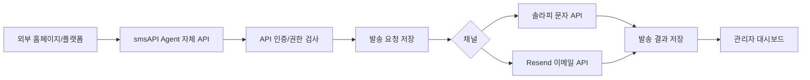

# 문자 및 이메일 발송 API 에이전트 개발 기획서

작성일: 2026-06-30  
프로젝트 폴더: `smsAPI`  
제품명 임시안: `smsAPI Agent`  
목표: 솔라피 문자 발송과 Resend 이메일 발송을 하나의 내부 API로 묶어, 다른 홈페이지와 플랫폼에서 공통 발송 인프라처럼 사용할 수 있는 에이전트를 구축한다.

## 1. 제품 한 줄 정의

관리자가 솔라피와 Resend API 키를 등록하면, 여러 웹사이트와 플랫폼이 자체 API 키로 문자, 이메일, 인증번호, 알림, 마케팅 메시지를 발송할 수 있게 해주는 통합 발송 에이전트.

## 2. 구축 목적

- 여러 서비스마다 솔라피와 Resend 연동 코드를 반복 개발하지 않는다.
- 문자와 이메일 발송 이력, 실패, 재시도, 사용량을 한 곳에서 관리한다.
- 각 홈페이지나 플랫폼에는 `smsAPI Agent`의 자체 API만 연결한다.
- 외부 발송사 API 키는 관리자 설정에서만 관리하고, 개별 서비스에는 노출하지 않는다.
- 향후 카카오 알림톡, 네이버웍스, Slack, 웹훅 등 추가 채널을 붙일 수 있는 구조로 만든다.

## 3. 연동 플랫폼

## 3.1 솔라피 문자 발송

용도:

- SMS, LMS, MMS 발송
- 휴대폰 인증번호 발송
- 예약, 결제, 가입, 상태 변경 알림
- 운영자 공지 또는 마케팅 문자

연동 기준:

- 공식 개발 문서: [SOLAPI Developers](https://solapi.com/developers)
- API Key 기반 인증 사용
- 발신번호는 솔라피 콘솔에서 사전 등록된 번호만 사용
- 문자 발송 결과와 실패 사유를 내부 발송 이력에 저장

관리자가 입력할 값:

- 솔라피 API Key
- 솔라피 API Secret
- 기본 발신번호
- 발송 허용 여부
- 테스트 모드 여부

## 3.2 Resend 이메일 발송

용도:

- 회원가입 인증 이메일
- 비밀번호 재설정
- 주문, 결제, 예약, 상태 변경 알림
- 운영 공지 및 마케팅 이메일

연동 기준:

- 공식 개발 문서: [Resend API Reference](https://resend.com/docs/api-reference/emails/send-email)
- `Authorization: Bearer <API_KEY>` 방식 사용
- 발신 도메인은 Resend에서 검증 완료된 도메인만 사용
- 발송 성공, 실패, 반송, 수신 거부 이벤트를 저장할 수 있도록 웹훅 확장 구조를 둔다.

관리자가 입력할 값:

- Resend API Key
- 기본 발신 이메일
- 기본 발신자 이름
- 기본 Reply-To
- 발송 허용 여부
- 테스트 모드 여부

## 4. 주요 사용자

관리자:

- 외부 발송사 API 키를 등록한다.
- 자체 API 클라이언트를 발급한다.
- 발송 가능 채널, 일일 한도, 월 한도, 허용 도메인을 설정한다.
- 전체 발송 이력, 실패율, 사용량, 비용 추정치를 확인한다.

서비스 운영자:

- 본인이 운영하는 홈페이지나 플랫폼에서 자체 API 키를 사용한다.
- 문자와 이메일 템플릿을 등록한다.
- 발송 결과와 실패 사유를 확인한다.

외부 서비스 또는 홈페이지:

- `smsAPI Agent`의 내부 API를 호출해 문자나 이메일을 발송한다.
- 솔라피와 Resend API 키를 직접 알 필요가 없다.

## 5. MVP 범위

## 5.1 반드시 구현

- 관리자 로그인
- 관리자 설정 화면
- 솔라피 API Key, Secret, 기본 발신번호 저장
- Resend API Key, 기본 발신 이메일 저장
- 자체 API 클라이언트 생성
- 자체 API Key 발급 및 폐기
- 문자 단건 발송 API
- 이메일 단건 발송 API
- 문자/이메일 공통 발송 이력
- 발송 성공, 실패, 대기 상태 저장
- 실패 사유 저장
- 테스트 발송 기능
- API 호출 로그
- 일일 발송 한도
- 관리자 대시보드

## 5.2 2차 범위

- 문자 대량 발송
- 이메일 대량 발송
- 예약 발송
- 템플릿 변수 치환
- 발송 승인 워크플로우
- 웹훅 수신 및 상태 자동 갱신
- 실패 건 자동 재시도
- 클라이언트별 비용 리포트
- 수신 거부 목록 관리
- 카카오 알림톡 채널 추가

## 5.3 제외 범위

- 실제 통신판매, 광고성 메시지 법률 검토 자동화
- 외부 서비스 회원 DB 직접 관리
- 결제 시스템
- 고객센터 티켓 시스템
- AI 자동 문구 생성

## 6. 시스템 구조



구성 모듈:

- Admin Web: 관리자 설정, API 키 관리, 발송 이력 확인
- Public API: 외부 홈페이지나 플랫폼이 호출하는 자체 API
- Provider Adapter: 솔라피, Resend 연동 모듈
- Message Queue: 발송 요청을 안정적으로 처리하는 대기열
- Delivery Log: 발송 상태와 실패 사유 저장
- Webhook Receiver: 외부 발송사의 이벤트 수신

## 7. 자체 API 설계

기본 주소 예시:

```text
https://api.example.com
```

인증 방식:

```http
Authorization: Bearer 자체_API_KEY
```

## 7.1 문자 발송 API

```http
POST /v1/messages/sms
Content-Type: application/json
Authorization: Bearer 자체_API_KEY
```

요청 예시:

```json
{
  "to": "01012345678",
  "from": "0212345678",
  "text": "[서비스명] 인증번호는 123456입니다.",
  "type": "SMS",
  "clientRequestId": "order-10001-sms-1"
}
```

응답 예시:

```json
{
  "ok": true,
  "messageId": "msg_20260630_000001",
  "status": "queued"
}
```

## 7.2 이메일 발송 API

```http
POST /v1/messages/email
Content-Type: application/json
Authorization: Bearer 자체_API_KEY
```

요청 예시:

```json
{
  "to": "customer@example.com",
  "from": "noreply@example.com",
  "subject": "가입을 완료해 주세요",
  "html": "<p>아래 버튼을 눌러 가입을 완료해 주세요.</p>",
  "text": "아래 링크를 눌러 가입을 완료해 주세요.",
  "clientRequestId": "signup-10001-email-1"
}
```

응답 예시:

```json
{
  "ok": true,
  "messageId": "email_20260630_000001",
  "status": "queued"
}
```

## 7.3 발송 상태 조회 API

```http
GET /v1/messages/{messageId}
Authorization: Bearer 자체_API_KEY
```

응답 예시:

```json
{
  "messageId": "msg_20260630_000001",
  "channel": "sms",
  "status": "sent",
  "provider": "solapi",
  "requestedAt": "2026-06-30T12:00:00+09:00",
  "sentAt": "2026-06-30T12:00:03+09:00"
}
```

## 8. 관리자 설정 화면

## 8.1 외부 연동 설정

솔라피 설정:

- API Key
- API Secret
- 기본 발신번호
- 테스트 발송 수신번호
- 사용 여부
- 연결 테스트 버튼

Resend 설정:

- API Key
- 기본 발신 이메일
- 기본 발신자 이름
- Reply-To
- 테스트 발송 수신 이메일
- 사용 여부
- 연결 테스트 버튼

보안 처리:

- API Secret과 API Key는 저장 후 전체 값을 다시 보여주지 않는다.
- 화면에는 마지막 4자리만 표시한다.
- 키 변경 시 관리자 비밀번호 재확인을 요구한다.
- 저장 값은 DB에 암호화해서 보관한다.

## 8.2 자체 API 클라이언트 관리

관리 항목:

- 클라이언트 이름
- 담당자
- 허용 채널: 문자, 이메일
- 허용 발신번호
- 허용 발신 이메일 도메인
- 일일 문자 한도
- 일일 이메일 한도
- 월간 한도
- API Key 발급/재발급/폐기
- 활성/비활성 상태

## 9. 데이터 모델 초안

## 9.1 provider_settings

```json
{
  "provider": "solapi",
  "enabled": true,
  "configEncrypted": "...",
  "maskedKey": "****1234",
  "updatedAt": "2026-06-30T12:00:00+09:00",
  "updatedBy": "admin"
}
```

## 9.2 api_clients

```json
{
  "id": "client_001",
  "name": "쇼핑몰 A",
  "apiKeyHash": "...",
  "allowedChannels": ["sms", "email"],
  "allowedSenders": ["0212345678", "noreply@example.com"],
  "dailyLimit": {
    "sms": 1000,
    "email": 5000
  },
  "enabled": true
}
```

## 9.3 message_logs

```json
{
  "id": "msg_20260630_000001",
  "clientId": "client_001",
  "channel": "sms",
  "provider": "solapi",
  "toMasked": "010****5678",
  "from": "0212345678",
  "status": "sent",
  "providerMessageId": "...",
  "errorCode": null,
  "errorMessage": null,
  "requestedAt": "2026-06-30T12:00:00+09:00",
  "sentAt": "2026-06-30T12:00:03+09:00"
}
```

## 10. 발송 상태 정의

- `queued`: 발송 요청 접수
- `sending`: 외부 발송사 호출 중
- `sent`: 외부 발송사 접수 또는 발송 성공
- `failed`: 발송 실패
- `rejected`: 내부 정책으로 발송 거절
- `cancelled`: 예약 발송 취소

## 11. 에러 정책

공통 에러 응답:

```json
{
  "ok": false,
  "error": {
    "code": "DAILY_LIMIT_EXCEEDED",
    "message": "일일 발송 한도를 초과했습니다."
  }
}
```

주요 에러 코드:

- `INVALID_API_KEY`
- `CHANNEL_DISABLED`
- `PROVIDER_NOT_CONFIGURED`
- `SENDER_NOT_ALLOWED`
- `DAILY_LIMIT_EXCEEDED`
- `INVALID_RECIPIENT`
- `TEMPLATE_NOT_FOUND`
- `PROVIDER_ERROR`
- `DUPLICATE_CLIENT_REQUEST_ID`

## 12. 보안 요구사항

- 자체 API Key는 원문 저장 금지, 해시만 저장
- 솔라피 Secret과 Resend API Key는 암호화 저장
- 관리자 설정 변경 로그 저장
- 발송 요청 원문 중 개인정보는 최소 보관
- 수신번호와 이메일은 마스킹해서 목록에 표시
- 관리자 계정 2단계 인증 확장 가능 구조
- API 요청 속도 제한 적용
- 클라이언트별 IP 허용 목록 확장 가능 구조
- 관리자 화면과 API 서버는 HTTPS 필수

## 13. 개인정보 및 광고성 메시지 주의사항

- 인증, 주문, 예약 등 정보성 메시지와 마케팅 메시지를 구분한다.
- 광고성 문자는 수신 동의, 수신 거부 문구, 발신자 표시 정책을 별도 관리한다.
- 수신 거부 목록을 2차 범위에 포함하되, 마케팅 발송을 시작하기 전에는 반드시 구현한다.
- 발송 이력에는 운영에 필요한 최소 정보만 저장한다.
- 서비스별 개인정보 처리방침에 문자/이메일 발송 위탁 또는 이용 목적을 반영해야 한다.

## 14. 권장 기술 스택

현재 폴더의 기존 프로젝트 흐름과 맞추려면 1차 MVP는 Node.js 기반으로 시작하는 것이 좋다.

- Runtime: Node.js
- Server: Express
- Admin UI: 기존 정적 HTML/CSS/JS 또는 React 확장
- Storage MVP: JSON 파일 또는 SQLite
- Storage 운영형: PostgreSQL
- Queue MVP: 내부 작업 큐
- Queue 운영형: BullMQ + Redis
- Encryption: Node.js crypto
- Logging: 파일 로그 + DB 감사 로그

권장 단계:

- 빠른 MVP: Express + SQLite
- 운영 전환: Express/NestJS + PostgreSQL + Redis

## 15. 개발 단계

## 15.1 1단계: 기초 서버와 관리자 설정

- `smsAPI` 서버 초기화
- 관리자 로그인
- 솔라피/Resend 설정 저장
- 연결 테스트 기능
- 자체 API 클라이언트 생성

완료 기준:

- 관리자가 API 키를 저장할 수 있다.
- 저장된 키로 테스트 문자와 테스트 이메일을 보낼 수 있다.

## 15.2 2단계: 자체 발송 API

- `/v1/messages/sms`
- `/v1/messages/email`
- `/v1/messages/{messageId}`
- 자체 API Key 인증
- 발송 이력 저장
- 일일 한도 적용

완료 기준:

- 다른 홈페이지에서 자체 API Key로 문자와 이메일을 발송할 수 있다.
- 발송 결과를 조회할 수 있다.

## 15.3 3단계: 안정화

- 실패 사유 표준화
- 재시도 정책
- 중복 요청 방지
- 속도 제한
- 관리자 감사 로그
- 발송 통계 대시보드

완료 기준:

- 장애 발생 시 어떤 요청이 실패했는지 추적할 수 있다.
- 같은 요청이 중복 발송되지 않는다.

## 15.4 4단계: 운영 기능 확장

- 템플릿 관리
- 예약 발송
- 대량 발송
- 웹훅 수신
- 수신 거부 관리
- 클라이언트별 비용 리포트

## 16. 화면 구성

관리자 메뉴:

- 대시보드
- 발송 이력
- 문자 발송 테스트
- 이메일 발송 테스트
- API 클라이언트
- 솔라피 설정
- Resend 설정
- 사용량/한도
- 관리자 로그

대시보드 지표:

- 오늘 문자 발송 건수
- 오늘 이메일 발송 건수
- 실패 건수
- 실패율
- 클라이언트별 사용량
- 채널별 사용량
- 최근 실패 요청

## 17. 다른 홈페이지에서 사용하는 방식

다른 홈페이지는 솔라피나 Resend를 직접 호출하지 않고 다음처럼 `smsAPI Agent`만 호출한다.

```js
await fetch("https://api.example.com/v1/messages/sms", {
  method: "POST",
  headers: {
    "Content-Type": "application/json",
    "Authorization": "Bearer 자체_API_KEY"
  },
  body: JSON.stringify({
    to: "01012345678",
    text: "[서비스명] 인증번호는 123456입니다.",
    clientRequestId: "signup-10001"
  })
});
```

장점:

- 외부 서비스에는 자체 API Key만 배포한다.
- 발송사 변경 시 외부 홈페이지 코드를 크게 수정하지 않는다.
- 발송 정책, 한도, 감사 로그를 중앙에서 통제한다.

## 18. API 문서화 요구사항

개발 완료 시 다음 문서를 함께 제공한다.

- 자체 API 인증 방식
- 문자 발송 API
- 이메일 발송 API
- 상태 조회 API
- 에러 코드 목록
- 요청 제한 정책
- JavaScript 연동 예제
- PHP 연동 예제
- Python 연동 예제

## 19. 성공 기준

- 관리자가 솔라피와 Resend API 키를 직접 입력해 저장할 수 있다.
- 연결 테스트로 문자와 이메일 발송 가능 여부를 확인할 수 있다.
- 외부 홈페이지가 자체 API Key 하나로 문자와 이메일을 보낼 수 있다.
- 발송 이력과 실패 사유가 관리자 화면에 남는다.
- 클라이언트별 발송 한도를 설정할 수 있다.
- 외부 발송사 키가 외부 홈페이지 코드에 노출되지 않는다.

## 20. 우선 구현 순서

1. 프로젝트 기본 서버 생성
2. 관리자 로그인
3. 설정 저장소와 암호화 저장
4. 솔라피 연결 테스트
5. Resend 연결 테스트
6. 자체 API Key 발급
7. 문자 발송 API
8. 이메일 발송 API
9. 발송 이력 화면
10. 한도와 중복 요청 방지

## 21. 참고 공식 문서

- [SOLAPI Developers](https://solapi.com/developers)
- [SOLAPI API 시작하기](https://solapi.com/developers/api/start)
- [Resend Send Email API](https://resend.com/docs/api-reference/emails/send-email)
- [Resend API Keys](https://resend.com/docs/dashboard/api-keys/introduction)
